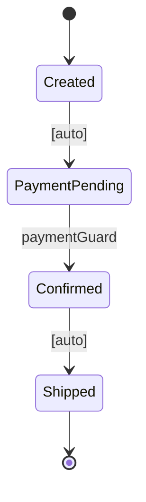

[English version](README.md)

# Carta

階層ステートマシン + データフロー検証 — **Java。**

tramli の上位互換: tramli の全機能に加え、Harel の Statechart 形式主義から**階層状態、entry/exit アクション、イベントバブリング**を統合。

> **Carta** = 地図 / 海図。ステートマシンがそのまま地図になる — 読めば領域がわかる。

**起源**: David Harel と Pat Helland が独立にステートマシンを設計し、両者ともデータフロー検証がパラダイム非依存であると結論した [DGE セッション](https://github.com/opaopa6969/tramli)から誕生。

---

## 目次

- [なぜ Carta が必要か](#なぜ-carta-が必要か)
- [クイックスタート — Harel モード](#クイックスタート--harel-モード) — 階層、イベント、entry/exit
- [クイックスタート — tramli モード](#クイックスタート--tramli-モード) — auto/external/branch, requires/produces
- [コアコンセプト](#コアコンセプト) — 構成要素
  - [StateNode](#statenode) — 階層状態 (Harel)
  - [Event](#event) — ファーストクラスのイベント型 (Harel)
  - [StateProcessor](#stateprocessor) — requires/produces 付きビジネスロジック (tramli)
  - [TransitionGuard](#transitionguard) — 外部イベント検証 (tramli)
  - [BranchProcessor](#branchprocessor) — 条件分岐 (tramli)
  - [StateContext](#statecontext) — デュアルモードコンテキスト (String + Class キー)
  - [StateMachine](#statemachine) — ビルド時検証付き定義
  - [CartaEngine](#cartaengine) — Auto-chain 付きエグゼキュータ
  - [FlowStore](#flowstore) — 差し替え可能な永続化
- [4種類の遷移](#4種類の遷移) — Event, Auto, External, Branch
- [Auto-Chain（自動連鎖）](#auto-chain自動連鎖) — 1回の呼び出しで複数遷移が発火
- [Multi-External 遷移 (DD-020)](#multi-external-遷移-dd-020) — 1状態から複数ガード
- [ビルド時検証](#ビルド時検証) — `build()` がチェックする7項目
- [requires / produces 契約](#requires--produces-契約) — Processor 間のデータフロー
- [Entry / Exit アクション](#entry--exit-アクション) — Harel LCA セマンティクス
- [Mermaid 図の自動生成](#mermaid-図の自動生成) — コード = 図
- [データフローグラフ](#データフローグラフ) — データ依存の自動分析
- [FlowStore 永続化](#flowstore-永続化) — 長期フローの保存と復元
- [なぜ LLM と相性が良いか](#なぜ-llm-と相性が良いか)
- [パフォーマンス](#パフォーマンス)
- [ユースケース](#ユースケース)
- [tramli との比較](#tramli-との比較)
- [用語集](#用語集)

---

## なぜ Carta が必要か

tramli は**データフロー検証がパラダイム非依存**であることを証明した (DD-021)。flat enum でもイベントログでも Statecharts でも等しく機能する。

しかし tramli は検証精度のために表現力を意図的にトレードオフしている: flat enum のみ、階層なし。

Carta は問う: **選ばなくていいとしたら？**

```
tramli:  flat enum  ★★★ 検証精度, ★☆☆ 表現力
Harel:   階層       ★☆☆ 検証精度, ★★★ 表現力
Carta:   両方       ★★★ 検証精度 (flat) + ★★★ 表現力 (階層)
```

完全なデータフロー検証が必要なら flat 状態を使う。構造的表現力が必要なら階層を使う。同じ定義内で自由に混合できる。

---

## クイックスタート — Harel モード

### 1. 階層状態と entry/exit を定義する

```java
Event start = Event.of("Start");
Event payment = Event.of("PaymentReceived");
Event ship = Event.of("Ship");
Event cancel = Event.of("Cancel");

var order = Carta.define("Order")
    .root("Order")
    .initial("Created")
    .state("Processing")
        .onEntry(ctx -> ctx.put("processing", true))
        .onExit(ctx -> ctx.put("processing", false))
        .initial("PaymentPending")
        .state("Confirmed").end()
        .terminal("Shipped")
    .end()
    .terminal("Cancelled")
    .transition().from("Created").on(start).to("PaymentPending")
    .transition().from("PaymentPending").on(payment)
        .guard(ctx -> ctx.get("amount", Integer.class) > 0)
        .action(ctx -> ctx.put("confirmed", true))
        .to("Confirmed")
    .transition().from("Confirmed").on(ship).to("Shipped")
    .transition().from("Processing").on(cancel).to("Cancelled")
    .build();
```

### 2. 実行する

```java
var engine = Carta.start(order);
engine.send(start);                        // Created → PaymentPending
engine.send(payment, "amount", 1000);      // PaymentPending → Confirmed
engine.send(ship);                         // Confirmed → Shipped（終端）
```

### 3. イベントバブリング

Cancel は `Processing`（親）に定義。どの子状態からでも発火する:

```java
engine.send(cancel);  // PaymentPending, Confirmed, どの子からでも動作
```

これが Harel の Statechart セマンティクス — イベントは階層を上にバブルする。

---

## クイックスタート — tramli モード

### 1. requires/produces 付き Processor を定義する

```java
StateProcessor initProcessor = new StateProcessor() {
    @Override public Set<Class<?>> produces() { return Set.of(OrderId.class); }
    @Override public void process(StateContext ctx) {
        ctx.put(OrderId.class, new OrderId("ORD-001"));
    }
};

TransitionGuard paymentGuard = new TransitionGuard() {
    @Override public String name() { return "paymentGuard"; }
    @Override public Set<Class<?>> requires() { return Set.of(PaymentConfirmation.class); }
    @Override public GuardOutput evaluate(StateContext ctx) {
        var pc = ctx.get(PaymentConfirmation.class);
        return pc.amount() > 0
            ? GuardOutput.accepted()
            : GuardOutput.rejected("不正な金額");
    }
};
```

### 2. フローを定義する

```java
var order = Carta.define("Order")
    .root("Order")
    .initial("Created")
    .state("PaymentPending").end()
    .state("Confirmed").end()
    .terminal("Shipped")
    .auto("Created", "PaymentPending", initProcessor)
    .external("PaymentPending", "Confirmed", paymentGuard)
    .auto("Confirmed", "Shipped", shipProcessor)
    .build();  // ← ここでビルド時検証
```

### 3. 実行する

```java
var engine = Carta.start(order);
// Auto-chain 発火: Created → PaymentPending（停止、外部イベント待ち）

engine.resume(Map.of(PaymentConfirmation.class, new PaymentConfirmation("TX-1", 1000)));
// Guard 通過 → 自動連鎖: PaymentPending → Confirmed → Shipped（終端）
```

### 4. Mermaid 図を生成する

```java
String mermaid = order.toMermaid();
```



---

## コアコンセプト

### StateNode

階層状態 — Carta と tramli の核心的な違い。状態はネストできる:

```java
.state("Processing")                 // 合成状態
    .onEntry(ctx -> ...)             // 入場時に発火
    .onExit(ctx -> ...)              // 退場時に発火
    .initial("PaymentPending")       // 初期子状態
    .state("Confirmed").end()        // 葉の子状態
    .terminal("Shipped")             // 終端の葉
.end()                               // 一階層上がる
```

合成状態は初期子を持つ。合成状態への遷移時、エンジンは初期子の葉まで降下する。

### Event

ファーストクラスのイベント型（Harel 形式主義）。tramli の `requires()` による暗黙ルーティングとは異なり、Carta はイベントを明示する:

```java
Event paymentReceived = Event.of("PaymentReceived");
engine.send(paymentReceived);
```

イベントは階層をバブルする — 親状態の `Cancel` イベントはどの子状態からでも発火。

### StateProcessor

1つの [Auto 遷移](#auto-遷移)のビジネスロジック。入出力を宣言:

```java
public interface StateProcessor {
    default Set<Class<?>> requires() { return Set.of(); }
    default Set<Class<?>> produces() { return Set.of(); }
    void process(StateContext ctx);
}
```

`requires()` と `produces()` は単なるドキュメントではない — **[build() 時に検証](#ビルド時検証)** される。

### TransitionGuard

[External 遷移](#external-遷移)を検証する。構造化された [GuardOutput](#guard-output) を返す:

```java
public interface TransitionGuard {
    String name();                     // ソース状態ごとに一意（DD-020）
    default Set<Class<?>> requires() { return Set.of(); }
    GuardOutput evaluate(StateContext ctx);
}
```

`sealed interface` [GuardOutput](#guard-output) は正確に3バリアント:

| バリアント | 意味 |
|-----------|------|
| `Accepted(data)` | Guard 通過。オプションのデータをコンテキストにマージ。 |
| `Rejected(reason)` | Guard 拒否。失敗カウント増加。 |
| `Expired` | フロー TTL 超過。 |

`requires()` は[型ベースルーティング](#multi-external-遷移-dd-020)を可能にする — 複数の external 遷移が同じソース状態を共有するとき、エンジンは `requires()` の型を外部データとマッチングしてガードを選択する。

### BranchProcessor

条件分岐。ラベルを返し、ターゲット状態にマッピング:

```java
public interface BranchProcessor {
    default Set<Class<?>> requires() { return Set.of(); }
    String decide(StateContext ctx);  // 分岐ラベルを返す
}
```

```java
.branch("Routing", shippingRouter, Map.of(
    "express", "ExpressShipped",
    "standard", "StandardShipped"
))
```

### StateContext

デュアルモードコンテキスト — Harel（String キー）と tramli（Class キー）の両方:

```java
// Harel モード（String キー）
ctx.put("amount", 1000);
int amount = ctx.get("amount", Integer.class);

// tramli モード（Class キー、型安全）
ctx.put(OrderId.class, new OrderId("ORD-001"));
OrderId id = ctx.get(OrderId.class);       // 型安全、キャスト不要
Optional<OrderId> opt = ctx.find(OrderId.class);
boolean has = ctx.has(OrderId.class);
Set<Class<?>> types = ctx.availableTypes();
```

**なぜ Class キーか？** tramli と同じ理由:
1. **タイポ不可** — `ctx.get(OrderId.class)` はスペルミスできない
2. **キャスト不要** — 戻り値型は推論される
3. **検証可能** — [requires/produces](#requires--produces-契約) が同じクラスを使い、[ビルド時検証](#ビルド時検証)を可能にする

### StateMachine

DSL で構築し `build()` で検証される不変定義:

```java
var machine = Carta.define("order")
    .root("Order")
    .initial("Created")
    // ... 状態、遷移 ...
    .build();  // ← ここで7項目検証
```

4種類の[遷移タイプ](#4種類の遷移)すべてをサポートし、[Mermaid 図](#mermaid-図の自動生成)を生成する。

### CartaEngine

エグゼキュータ。`send()`（Harel）と `resume()`（tramli）の両方をサポートし、[Auto-chain](#auto-chain自動連鎖) を実行:

```java
var engine = Carta.start(machine);
engine.send(event);                          // Harel モード
engine.resume(Map.of(Type.class, data));     // tramli モード
engine.currentState();                       // 現在の葉状態
engine.isCompleted();                        // 終端到達？
engine.log();                                // 遷移履歴
```

| メソッド | モード | 説明 |
|---------|-------|------|
| `send(event)` | Harel | イベント処理、Guard 評価、Action 実行、Auto-chain |
| `send(event, key, value)` | Harel | String キーデータ付きイベント送信 |
| `resume(data)` | tramli | 型マッチングで External Guard 選択、評価、Auto-chain |
| `toFlowInstance(id)` | 共通 | 永続化のため現在状態をエクスポート |

### FlowStore

差し替え可能な永続化インターフェース:

```java
public interface FlowStore {
    void save(FlowInstance instance);
    Optional<FlowInstance> load(String id);
    void delete(String id);
}
```

| 実装 | ユースケース |
|------|------------|
| `InMemoryFlowStore` | テスト、シングルプロセス。Carta に同梱。 |
| JDBC（自前実装） | PostgreSQL/MySQL + JSONB コンテキスト |
| Redis（自前実装） | TTL ベースの分散フロー |

---

## 4種類の遷移

フロー内の全ての矢印は4種類のいずれか:

| タイプ | トリガー | 由来 | 例 |
|-------|---------|------|-----|
| [**Event**](#event-遷移) | 明示的 `Event` オブジェクト | Harel | `Created --[Start]--> PaymentPending` |
| [**Auto**](#auto-遷移) | 前の遷移完了 | tramli | `Confirmed --> Shipped` |
| [**External**](#external-遷移) | `resume()` 経由の外部データ | tramli | `Pending --[paymentGuard]--> Confirmed` |
| [**Branch**](#branch-遷移) | `BranchProcessor` がラベル返却 | tramli | `Routing --> Express or Standard` |

4種類すべてを単一定義でサポートするのは Carta だけ。

---

## Auto-Chain（自動連鎖）

遷移（Event, External, Branch）の後、エンジンは [Auto](#auto-遷移) と [Branch](#branch-遷移) の遷移を [External](#external-遷移) 待ちか[終端状態](#終端状態)に到達するまで発火し続ける:

```
resume(PaymentConfirmation)
  → External: PaymentPending → Confirmed      ← Guard 検証
  → Auto:     Confirmed → Shipped             ← Processor 実行
  （終端 — フロー完了）
```

**1回の呼び出しで2つの遷移。** 各 Processor は自分のステップだけを知っている。

安全性: Auto-chain の深さ上限は 10。[DAG 検証](#ビルド時検証)がビルド時に Auto/Branch 遷移の循環を検出する。

---

## Multi-External 遷移 (DD-020)

同一状態から複数の external 遷移、`requires()` の型マッチングでルーティング:

```java
.external("Active", "Active", profileUpdateGuard)    // requires: ProfileUpdate
.external("Active", "Suspended", suspendGuard)        // requires: SuspendRequest
.external("Active", "Banned", banGuard)               // requires: BanOrder
```

`resume()` 呼び出し時、エンジンは:
1. 各ガードの `requires()` を提供されたデータ型と照合
2. 必要な型が存在しないガードをスキップ
3. マッチした最初のガードを評価
4. `Accepted` で遷移

自己遷移も動作: `Active → Active`（プロフィール更新 — 状態変化なし、ガード失敗カウント保持）。

ガード名はソース状態ごとに一意でなければならない — `build()` で強制。

---

## ビルド時検証

`build()` は7つの構造チェックを実行。いずれかが失敗すれば明確なエラー — **フロー実行前に。**

| # | チェック | 検出する問題 |
|---|---------|------------|
| 1 | 全遷移端点が存在する | 状態名のタイポ |
| 2 | 合成状態が初期子を持つ | 階層内の初期状態不足 |
| 3 | [終端](#終端状態)状態からの遷移がない | 終了すべき状態が終了しない |
| 4 | [Auto](#auto-遷移)/[Branch](#branch-遷移) 遷移が [DAG](#dag) を形成 | 無限 Auto-chain ループ |
| 5 | [External](#external-遷移) ガード名がソース状態ごとに一意 | 曖昧なガードルーティング |
| 6 | 全 [Branch](#branch-遷移) ターゲットが定義済み | `decide()` が未知ラベルを返す |
| 7 | [requires/produces](#requires--produces-契約) チェーン整合性 | ランタイムの「データがない」エラー |

---

## requires / produces 契約

全ての [StateProcessor](#stateprocessor) が必要なデータと提供するデータを宣言:

```java
@Override public Set<Class<?>> requires() { return Set.of(OrderId.class); }
@Override public Set<Class<?>> produces() { return Set.of(TrackingNumber.class); }
```

`build()` 時に、Carta は全ての `requires()` 型が上流のいずれかの Processor によって produce されていることを検証する。されていなければビルド失敗:

```
StateMachine 'Order' has 1 error(s):
  - Data-flow: CustomerProfile is required but never produced
```

---

## Entry / Exit アクション

LCA（最小共通祖先）を使った Harel の Statechart セマンティクス:

- **退出**: exit アクションは現在の葉から LCA まで**上方向**に発火
- **入場**: entry アクションは LCA からターゲットの葉まで**下方向**に発火

```java
.state("Processing")
    .onEntry(ctx -> ctx.put("processing", true))   // Processing 入場時に発火
    .onExit(ctx -> ctx.put("processing", false))    // Processing 退場時に発火
```

例: `Confirmed`（Processing 内）から `Cancelled`（Processing 外）への遷移:
1. `Confirmed` 退出（アクションなし）
2. `Processing` 退出 → `processing = false`
3. `Cancelled` 入場（アクションなし）

合成状態内の内部遷移（例: `PaymentPending → Confirmed`）は合成状態の entry/exit を発火しない。

---

## Mermaid 図の自動生成

```java
String mermaid = machine.toMermaid();          // 階層付き状態図
String dataFlow = machine.toDataFlowMermaid(); // データフロー図
```

両方の図は **StateMachine 定義から生成** — エンジンが使うのと同じオブジェクト。古くなることがない。

---

## データフローグラフ

`build()` により **DataFlowGraph** の構築が可能 — データ型と Processor の二部グラフ:

```java
DataFlowGraph graph = machine.dataFlowGraph();

graph.availableAt("Confirmed");          // この状態で到達可能な型
graph.producersOf(OrderId.class);        // OrderId を produce するのは誰？
graph.consumersOf(OrderId.class);        // OrderId を consume するのは誰？
graph.deadData();                        // produce されたが consume されない型
graph.toMarkdown();                      // 人間が読めるレポート
```

| メソッド | 戻り値 | 説明 |
|---------|-------|------|
| `availableAt(state)` | `Set<Class<?>>` | ある状態でコンテキストに存在する型 |
| `producersOf(type)` | `List<String>` | この型を produce する状態/遷移 |
| `consumersOf(type)` | `List<String>` | この型を consume する状態/遷移 |
| `deadData()` | `List<Class<?>>` | produce されたが consume されない型 |
| `allTypes()` | `Set<Class<?>>` | データフロー内の全型 |
| `toMarkdown()` | `String` | Markdown 形式の完全データフローレポート |

---

## FlowStore 永続化

長期フローの保存と復元:

```java
// エクスポート
FlowInstance instance = engine.toFlowInstance("order-123");

// 保存
var store = Carta.memoryStore();
store.save(instance);

// ロードと復元
FlowInstance loaded = store.load("order-123").orElseThrow();
var restored = Carta.restore(machine, loaded);
restored.resume(Map.of(PaymentConfirmation.class, confirmation));
```

---

## なぜ LLM と相性が良いか

| 手続き的コードの問題 | Carta の解決 |
|--------------------|------------|
| 「1800行からハンドラを探す」 | StateMachine 定義を読む |
| 「この時点でどのデータが使える？」 | [requires()](#requires--produces-契約) か `graph.availableAt()` を確認 |
| 「変更が他を壊さないか？」 | 1 Processor = 1 閉じた単位 |
| 「エッジケースを忘れた」 | `sealed interface` [GuardOutput](#guard-output) → コンパイラが警告 |
| 「フロー図が古い」 | [コードから生成](#mermaid-図の自動生成) |
| 「無限ループを作ってしまった」 | [DAG チェック](#ビルド時検証)がビルド時に検出 |
| 「階層も検証も両方ほしい」 | Carta は両方持っている |

**核心原則: LLM はハルシネートするが、コンパイラと `build()` はしない。**

---

## パフォーマンス

Carta のオーバーヘッドは I/O バウンドアプリケーションでは無視できる:

```
遷移あたり:     ~300-500ns（String 比較 + HashMap ルックアップ）
5遷移フロー:    ~2μs 合計

比較:
  DB INSERT:          1-5ms
  HTTP ラウンドトリップ: 50-500ms
  IdP OAuth 交換:     200-500ms

SM オーバーヘッド / 合計 = 0.0004%
```

---

## ユースケース

Carta は**状態、遷移、外部イベント**を持つあらゆるシステムで使える:

- **認証** — OIDC, Passkey, MFA, 招待フロー
- **決済** — 注文 → 支払 → 出荷 → 配達
- **承認** — 申請 → レビュー → 承認/却下 → 実行
- **オンボーディング** — サインアップ → メール確認 → プロフィール → 完了
- **ユーザーライフサイクル** — 登録 → 認証 → アクティブ → 停止/BAN/離脱 (DD-020)
- **CI/CD** — ビルド → テスト → デプロイ → 検証

---

## tramli との比較

| 機能 | tramli | Carta |
|------|--------|-------|
| Flat enum 状態 | Yes | Yes |
| 階層状態 | No | **Yes** |
| Entry/exit アクション (Harel LCA) | No* | **Yes** |
| イベントバブリング | No | **Yes** |
| 明示的イベント (Harel) | No | **Yes** |
| 型安全コンテキスト (`Class<?>` キー) | Yes | Yes |
| requires/produces 契約 | Yes | Yes |
| Auto 遷移 + Auto-chain | Yes | Yes |
| External 遷移 + Guard | Yes | Yes |
| Branch 遷移 | Yes | Yes |
| Multi-external/状態 (DD-020) | Yes | Yes |
| ビルド時データフロー検証 | Yes | Yes |
| Auto/Branch DAG 循環検出 | Yes | Yes |
| Guard 失敗カウント | Yes | Yes |
| FlowStore 永続化 | Yes | Yes |
| Mermaid 生成 | Yes | Yes |
| DataFlowGraph 分析 | Yes | Yes |
| ゼロ依存 | Yes | Yes |
| 言語 | Java, TS, Rust | Java |

*tramli は DD-020 で entry/exit マーカーを追加。Carta は完全な Harel entry/exit + LCA セマンティクスを持つ。

---

## 用語集

| 用語 | 定義 |
|-----|------|
| <a id="auto-遷移"></a>**Auto 遷移** | 前のステップ完了時に即座に発火する遷移。外部イベント不要。[Auto-chain](#auto-chain自動連鎖) の一部としてエンジンが実行。 |
| <a id="auto-chain"></a>**Auto-chain** | Auto と Branch の連続遷移を External 遷移か終端状態に到達するまで実行するエンジンの動作。最大深度: 10。 |
| <a id="branch-遷移"></a>**Branch 遷移** | [BranchProcessor](#branchprocessor) がラベルを返してターゲット状態を決定する遷移。Auto と同様に即座に発火。 |
| <a id="dag"></a>**DAG** | 有向非巡回グラフ。Auto/Branch 遷移は DAG を形成しなければならない — 循環禁止。[build()](#ビルド時検証) で検証。 |
| <a id="event-遷移"></a>**Event 遷移** | 明示的 [Event](#event) オブジェクトで発火する遷移。Harel Statechart 形式主義。Guard と Action をサポート。 |
| <a id="external-遷移"></a>**External 遷移** | `resume()` 経由の型付き外部データで発火する遷移。[TransitionGuard](#transitionguard) が必要。エンジンは Auto-chain を停止して待機。 |
| <a id="guard-output"></a>**GuardOutput** | [TransitionGuard](#transitionguard) が返す `sealed interface`。3バリアント: `Accepted`, `Rejected`, `Expired`。 |
| <a id="lca"></a>**LCA** | 最小共通祖先 (Least Common Ancestor)。ソース状態とターゲット状態の両方の祖先である階層内最下位ノード。どの entry/exit アクションが発火するかを決定。 |
| <a id="終端状態"></a>**終端状態** | フローが終了する状態。外部遷移禁止。例: `Shipped`, `Cancelled`, `Banned`。 |

---

## 要件

| 言語 | バージョン | 依存 |
|------|----------|------|
| Java | 21+ | ゼロ |

## ライセンス

MIT
