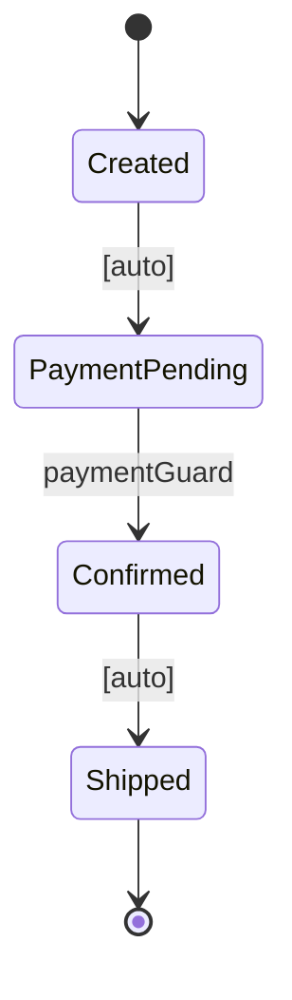

[日本語版はこちら / Japanese](README-ja.md)

# Carta

Hierarchical state machine with data-flow verification — **Java.**

tramli's superset: everything tramli does, plus **hierarchical states, entry/exit actions, and event bubbling** from Harel's Statechart formalism.

> **Carta** = map / chart. The state machine IS the map — read it and you know the territory.

**Origin**: [DGE sessions](https://github.com/opaopa6969/tramli) where David Harel and Pat Helland independently designed state machines and both converged on tramli's data-flow verification as paradigm-agnostic.

---

## Table of Contents

- [Why Carta exists](#why-carta-exists)
- [Quick Start — Harel Mode](#quick-start--harel-mode) — hierarchy, events, entry/exit
- [Quick Start — tramli Mode](#quick-start--tramli-mode) — auto/external/branch, requires/produces
- [Core Concepts](#core-concepts) — the building blocks
  - [StateNode](#statenode) — hierarchical state (Harel)
  - [Event](#event) — first-class event type (Harel)
  - [StateProcessor](#stateprocessor) — business logic with requires/produces (tramli)
  - [TransitionGuard](#transitionguard) — validates external events (tramli)
  - [BranchProcessor](#branchprocessor) — conditional routing (tramli)
  - [StateContext](#statecontext) — dual-mode context (String + Class keyed)
  - [StateMachine](#statemachine) — definition with build-time validation
  - [CartaEngine](#cartaengine) — executor with auto-chain
  - [FlowStore](#flowstore) — pluggable persistence
- [Four Transition Types](#four-transition-types) — Event, Auto, External, Branch
- [Auto-Chain](#auto-chain) — how multiple transitions fire in one call
- [Multi-External Transitions (DD-020)](#multi-external-transitions-dd-020) — multiple guards per state
- [Build-Time Validation](#build-time-validation) — what `build()` checks
- [requires / produces Contract](#requires--produces-contract) — data-flow between processors
- [Entry / Exit Actions](#entry--exit-actions) — Harel LCA semantics
- [Mermaid Diagram Generation](#mermaid-diagram-generation) — code = diagram
- [Data-Flow Graph](#data-flow-graph) — automatic data dependency analysis
- [FlowStore Persistence](#flowstore-persistence) — save and restore long-lived flows
- [Why LLMs Love This](#why-llms-love-this)
- [Performance](#performance)
- [Use Cases](#use-cases)
- [Comparison with tramli](#comparison-with-tramli)
- [Glossary](#glossary)

---

## Why Carta exists

tramli proved that **data-flow verification is paradigm-agnostic**. It works on flat enums, event logs, and Statecharts equally (DD-021).

But tramli deliberately trades expressiveness for verification precision: flat enums only, no hierarchy.

Carta asks: **what if you don't have to choose?**

```
tramli:  flat enum ★★★ verification, ★☆☆ expressiveness
Harel:   hierarchy ★☆☆ verification, ★★★ expressiveness
Carta:   both      ★★★ verification (flat) + ★★★ expressiveness (hierarchy)
```

Use flat states when you need full data-flow verification. Use hierarchy when you need structural expressiveness. Mix both freely in the same machine.

---

## Quick Start — Harel Mode

### 1. Define hierarchical states with entry/exit

```java
Event start = Event.of("Start");
Event payment = Event.of("PaymentReceived");
Event ship = Event.of("Ship");
Event cancel = Event.of("Cancel");

var order = Carta.define("Order")
    .root("Order")
    .initial("Created")
    .state("Processing")
        .onEntry(ctx -> ctx.put("processing", true))
        .onExit(ctx -> ctx.put("processing", false))
        .initial("PaymentPending")
        .state("Confirmed").end()
        .terminal("Shipped")
    .end()
    .terminal("Cancelled")
    .transition().from("Created").on(start).to("PaymentPending")
    .transition().from("PaymentPending").on(payment)
        .guard(ctx -> ctx.get("amount", Integer.class) > 0)
        .action(ctx -> ctx.put("confirmed", true))
        .to("Confirmed")
    .transition().from("Confirmed").on(ship).to("Shipped")
    .transition().from("Processing").on(cancel).to("Cancelled")
    .build();
```

### 2. Run it

```java
var engine = Carta.start(order);
engine.send(start);                        // Created → PaymentPending
engine.send(payment, "amount", 1000);      // PaymentPending → Confirmed
engine.send(ship);                         // Confirmed → Shipped (terminal)
```

### 3. Event bubbling

Cancel is defined on `Processing` (parent). It fires from any child state:

```java
engine.send(cancel);  // works from PaymentPending, Confirmed, or any child
```

This is Harel's Statechart semantics — events bubble up through the hierarchy.

---

## Quick Start — tramli Mode

### 1. Define processors with requires/produces

```java
StateProcessor initProcessor = new StateProcessor() {
    @Override public Set<Class<?>> produces() { return Set.of(OrderId.class); }
    @Override public void process(StateContext ctx) {
        ctx.put(OrderId.class, new OrderId("ORD-001"));
    }
};

TransitionGuard paymentGuard = new TransitionGuard() {
    @Override public String name() { return "paymentGuard"; }
    @Override public Set<Class<?>> requires() { return Set.of(PaymentConfirmation.class); }
    @Override public GuardOutput evaluate(StateContext ctx) {
        var pc = ctx.get(PaymentConfirmation.class);
        return pc.amount() > 0
            ? GuardOutput.accepted()
            : GuardOutput.rejected("Invalid amount");
    }
};
```

### 2. Define the flow

```java
var order = Carta.define("Order")
    .root("Order")
    .initial("Created")
    .state("PaymentPending").end()
    .state("Confirmed").end()
    .terminal("Shipped")
    .auto("Created", "PaymentPending", initProcessor)
    .external("PaymentPending", "Confirmed", paymentGuard)
    .auto("Confirmed", "Shipped", shipProcessor)
    .build();  // ← build-time validation here
```

### 3. Run it

```java
var engine = Carta.start(order);
// Auto-chain fires: Created → PaymentPending (stops, waiting for external)

engine.resume(Map.of(PaymentConfirmation.class, new PaymentConfirmation("TX-1", 1000)));
// Guard passes → auto-chain: PaymentPending → Confirmed → Shipped (terminal)
```

### 4. Generate Mermaid diagram

```java
String mermaid = order.toMermaid();
```



---

## Core Concepts

### StateNode

Hierarchical state — Carta's core difference from tramli. States can nest:

```java
.state("Processing")                 // composite state
    .onEntry(ctx -> ...)             // fires when entering
    .onExit(ctx -> ...)              // fires when exiting
    .initial("PaymentPending")       // initial child
    .state("Confirmed").end()        // leaf child
    .terminal("Shipped")             // terminal leaf
.end()                               // back up one level
```

Composite states have an initial child. When transitioning into a composite, the engine descends to the initial child leaf.

### Event

First-class event type (Harel formalism). Unlike tramli's implicit routing via `requires()`, Carta makes events explicit:

```java
Event paymentReceived = Event.of("PaymentReceived");
engine.send(paymentReceived);
```

Events bubble up through the hierarchy — a `Cancel` event on a parent state fires from any child.

### StateProcessor

Business logic for one [auto transition](#auto-transition). Declares inputs and outputs:

```java
public interface StateProcessor {
    default Set<Class<?>> requires() { return Set.of(); }
    default Set<Class<?>> produces() { return Set.of(); }
    void process(StateContext ctx);
}
```

`requires()` and `produces()` aren't documentation — they're **verified at [build() time](#build-time-validation)**.

### TransitionGuard

Validates an [external transition](#external-transition). Returns structured [GuardOutput](#guard-output):

```java
public interface TransitionGuard {
    String name();                     // unique per source state (DD-020)
    default Set<Class<?>> requires() { return Set.of(); }
    GuardOutput evaluate(StateContext ctx);
}
```

The `sealed interface` [GuardOutput](#guard-output) has exactly 3 variants:

| Variant | Meaning |
|---------|---------|
| `Accepted(data)` | Guard passed. Optional data merged into context. |
| `Rejected(reason)` | Guard refused. Failure count incremented. |
| `Expired` | Flow TTL exceeded. |

`requires()` enables [type-based routing](#multi-external-transitions-dd-020) — when multiple external transitions share a source state, the engine selects guards by matching `requires()` types against the external data.

### BranchProcessor

Conditional routing. Returns a label that maps to a target state:

```java
public interface BranchProcessor {
    default Set<Class<?>> requires() { return Set.of(); }
    String decide(StateContext ctx);  // returns branch label
}
```

```java
.branch("Routing", shippingRouter, Map.of(
    "express", "ExpressShipped",
    "standard", "StandardShipped"
))
```

### StateContext

Dual-mode context — both Harel (String-keyed) and tramli (Class-keyed) access:

```java
// Harel mode (String-keyed)
ctx.put("amount", 1000);
int amount = ctx.get("amount", Integer.class);

// tramli mode (Class-keyed, type-safe)
ctx.put(OrderId.class, new OrderId("ORD-001"));
OrderId id = ctx.get(OrderId.class);       // type-safe, no cast
Optional<OrderId> opt = ctx.find(OrderId.class);
boolean has = ctx.has(OrderId.class);
Set<Class<?>> types = ctx.availableTypes();
```

**Why Class-keyed?** Same reasons as tramli:
1. **No typos** — `ctx.get(OrderId.class)` can't be misspelled
2. **No casts** — return type is inferred
3. **Verifiable** — [requires/produces](#requires--produces-contract) use the same classes, enabling [build-time validation](#build-time-validation)

### StateMachine

Immutable definition built via DSL and validated at `build()`:

```java
var machine = Carta.define("order")
    .root("Order")
    .initial("Created")
    // ... states, transitions ...
    .build();  // ← 7-item validation here
```

The definition supports all four [transition types](#four-transition-types) and generates [Mermaid diagrams](#mermaid-diagram-generation).

### CartaEngine

Executor. Supports both `send()` (Harel) and `resume()` (tramli), with [auto-chain](#auto-chain):

```java
var engine = Carta.start(machine);
engine.send(event);                          // Harel mode
engine.resume(Map.of(Type.class, data));     // tramli mode
engine.currentState();                       // current leaf state
engine.isCompleted();                        // terminal reached?
engine.log();                                // transition history
```

| Method | Mode | Description |
|--------|------|-------------|
| `send(event)` | Harel | Process event, evaluate guard, fire action, auto-chain |
| `send(event, key, value)` | Harel | Send event with string-keyed data |
| `resume(data)` | tramli | Match external guards by type, evaluate, auto-chain |
| `toFlowInstance(id)` | Both | Export current state for persistence |

### FlowStore

Pluggable persistence interface:

```java
public interface FlowStore {
    void save(FlowInstance instance);
    Optional<FlowInstance> load(String id);
    void delete(String id);
}
```

| Implementation | Use case |
|-------|----------|
| `InMemoryFlowStore` | Tests, single-process apps. Ships with Carta. |
| JDBC (bring your own) | PostgreSQL/MySQL with JSONB context |
| Redis (bring your own) | Distributed flows with TTL-based expiry |

---

## Four Transition Types

Every arrow in the flow is one of four types:

| Type | Trigger | Origin | Example |
|------|---------|--------|---------|
| [**Event**](#event-transition) | Explicit `Event` object | Harel | `Created --[Start]--> PaymentPending` |
| [**Auto**](#auto-transition) | Previous transition completes | tramli | `Confirmed --> Shipped` |
| [**External**](#external-transition) | Outside data via `resume()` | tramli | `Pending --[paymentGuard]--> Confirmed` |
| [**Branch**](#branch-transition) | `BranchProcessor` returns label | tramli | `Routing --> Express or Standard` |

Carta is the only library that supports all four in a single definition.

---

## Auto-Chain

After any transition (Event, External, or Branch), the engine keeps firing [Auto](#auto-transition) and [Branch](#branch-transition) transitions until it hits an [External](#external-transition) wait or [terminal state](#terminal-state):

```
resume(PaymentConfirmation)
  → External: PaymentPending → Confirmed      ← guard validates
  → Auto:     Confirmed → Shipped             ← processor runs
  (terminal — flow done)
```

**One call, two transitions.** Each processor only knows its own step.

Safety: auto-chain depth capped at 10. [DAG validation](#build-time-validation) at build time ensures Auto/Branch transitions cannot form cycles.

---

## Multi-External Transitions (DD-020)

Multiple external transitions from the same state, routed by `requires()` type matching:

```java
.external("Active", "Active", profileUpdateGuard)    // requires: ProfileUpdate
.external("Active", "Suspended", suspendGuard)        // requires: SuspendRequest
.external("Active", "Banned", banGuard)               // requires: BanOrder
```

When `resume()` is called, the engine:
1. Checks each guard's `requires()` against the provided data types
2. Skips guards whose required types are not present
3. Evaluates the first matching guard
4. Transitions on `Accepted`

Self-transitions work: `Active → Active` for profile updates (no state change, guard failure counts preserved).

Guard names must be unique per source state — enforced at `build()`.

---

## Build-Time Validation

`build()` runs 7 structural checks. If any fail, you get a clear error — **before any flow runs.**

| # | Check | What it catches |
|---|-------|----------------|
| 1 | All transition endpoints exist | Typos in state names |
| 2 | Composite states have initial child | Missing initial in hierarchy |
| 3 | No transitions from [terminal](#terminal-state) states | States that should be final but aren't |
| 4 | [Auto](#auto-transition)/[Branch](#branch-transition) transitions form a [DAG](#dag) | Infinite auto-chain loops |
| 5 | [External](#external-transition) guard names unique per state | Ambiguous guard routing |
| 6 | All [branch](#branch-transition) targets defined | `decide()` returning unknown label |
| 7 | [requires/produces](#requires--produces-contract) chain integrity | "Data not available" errors at runtime |

---

## requires / produces Contract

Every [StateProcessor](#stateprocessor) declares what data it needs and provides:

```java
@Override public Set<Class<?>> requires() { return Set.of(OrderId.class); }
@Override public Set<Class<?>> produces() { return Set.of(TrackingNumber.class); }
```

At `build()` time, Carta verifies that every `requires()` type is produced by some processor upstream. If not, build fails:

```
StateMachine 'Order' has 1 error(s):
  - Data-flow: CustomerProfile is required but never produced
```

---

## Entry / Exit Actions

Harel's Statechart semantics using LCA (Least Common Ancestor):

- **Exiting**: exit actions fire from current leaf **UP** to LCA
- **Entering**: entry actions fire from LCA **DOWN** to target leaf

```java
.state("Processing")
    .onEntry(ctx -> ctx.put("processing", true))   // fires when entering Processing
    .onExit(ctx -> ctx.put("processing", false))    // fires when leaving Processing
```

Example: transitioning from `Confirmed` (inside Processing) to `Cancelled` (outside Processing):
1. Exit `Confirmed` (no action)
2. Exit `Processing` → `processing = false`
3. Enter `Cancelled` (no action)

Internal transitions within a composite (e.g., `PaymentPending → Confirmed`) do not trigger the composite's entry/exit.

---

## Mermaid Diagram Generation

```java
String mermaid = machine.toMermaid();        // state diagram with hierarchy
String dataFlow = machine.toDataFlowMermaid(); // data-flow diagram
```

Both diagrams are generated **from the StateMachine definition** — the same object the engine uses. They cannot be out of date.

---

## Data-Flow Graph

Every `build()` enables construction of a **DataFlowGraph** — a bipartite graph of data types and processors:

```java
DataFlowGraph graph = machine.dataFlowGraph();

graph.availableAt("Confirmed");          // types reachable at this state
graph.producersOf(OrderId.class);        // who produces OrderId?
graph.consumersOf(OrderId.class);        // who consumes OrderId?
graph.deadData();                        // produced but never consumed
graph.toMarkdown();                      // human-readable report
```

| Method | Returns | Description |
|--------|---------|-------------|
| `availableAt(state)` | `Set<Class<?>>` | Types available in context at a given state |
| `producersOf(type)` | `List<String>` | States/transitions that produce this type |
| `consumersOf(type)` | `List<String>` | States/transitions that consume this type |
| `deadData()` | `List<Class<?>>` | Types produced but never consumed |
| `allTypes()` | `Set<Class<?>>` | All types in the data flow |
| `toMarkdown()` | `String` | Full data-flow report in Markdown |

---

## FlowStore Persistence

Save and restore long-lived flows:

```java
// Export
FlowInstance instance = engine.toFlowInstance("order-123");

// Save
var store = Carta.memoryStore();
store.save(instance);

// Load and restore
FlowInstance loaded = store.load("order-123").orElseThrow();
var restored = Carta.restore(machine, loaded);
restored.resume(Map.of(PaymentConfirmation.class, confirmation));
```

---

## Why LLMs Love This

| Problem with procedural code | How Carta solves it |
|------------------------------|---------------------|
| "Read 1800 lines to find the handler" | Read the StateMachine definition |
| "What data is available at this point?" | Check [requires()](#requires--produces-contract) or `graph.availableAt()` |
| "Will my change break something else?" | 1 processor = 1 closed unit |
| "I forgot to handle an edge case" | `sealed interface` [GuardOutput](#guard-output) → compiler warns |
| "The flow diagram is outdated" | [Generated from code](#mermaid-diagram-generation) |
| "I generated an infinite loop" | [DAG check](#build-time-validation) at build time |
| "I need hierarchy AND verification" | Carta has both |

**The key principle: LLMs hallucinate, but compilers and `build()` don't.**

---

## Performance

Carta's overhead is negligible for any I/O-bound application:

```
Per transition:    ~300-500ns (String comparison + HashMap lookup)
5-transition flow: ~2μs total

For comparison:
  DB INSERT:          1-5ms
  HTTP round-trip:    50-500ms
  IdP OAuth exchange: 200-500ms

SM overhead / total = 0.0004%
```

---

## Use Cases

Carta works for any system with **states, transitions, and external events**:

- **Authentication** — OIDC, Passkey, MFA, invitation flows
- **Payments** — order → payment → fulfillment → delivery
- **Approvals** — request → review → approve/reject → execute
- **Onboarding** — signup → email verify → profile → complete
- **User lifecycle** — register → verify → active → suspend/ban/churn (DD-020)
- **CI/CD** — build → test → deploy → verify

---

## Comparison with tramli

| Feature | tramli | Carta |
|---------|--------|-------|
| Flat enum states | Yes | Yes |
| Hierarchical states | No | **Yes** |
| Entry/exit actions (Harel LCA) | No* | **Yes** |
| Event bubbling | No | **Yes** |
| Explicit events (Harel) | No | **Yes** |
| Type-safe context (`Class<?>` keyed) | Yes | Yes |
| requires/produces contracts | Yes | Yes |
| Auto transitions + auto-chain | Yes | Yes |
| External transitions + guards | Yes | Yes |
| Branch transitions | Yes | Yes |
| Multi-external per state (DD-020) | Yes | Yes |
| Build-time data-flow verification | Yes | Yes |
| Auto/Branch DAG cycle detection | Yes | Yes |
| Guard failure tracking | Yes | Yes |
| FlowStore persistence | Yes | Yes |
| Mermaid generation | Yes | Yes |
| DataFlowGraph analysis | Yes | Yes |
| Zero dependencies | Yes | Yes |
| Languages | Java, TS, Rust | Java |

*tramli added entry/exit markers in DD-020; Carta has full Harel entry/exit with LCA semantics.

---

## Glossary

| Term | Definition |
|------|-----------|
| <a id="auto-transition"></a>**Auto transition** | A transition that fires immediately when the previous step completes. No external event needed. Engine executes it as part of [auto-chain](#auto-chain). |
| <a id="auto-chain"></a>**Auto-chain** | The engine's behavior of executing consecutive Auto and Branch transitions until an External transition or terminal state is reached. Max depth: 10. |
| <a id="branch-transition"></a>**Branch transition** | A transition where a [BranchProcessor](#branchprocessor) decides the target state by returning a label. Fires immediately like Auto. |
| <a id="dag"></a>**DAG** | Directed Acyclic Graph. Auto/Branch transitions must form a DAG — no cycles. Verified by [build()](#build-time-validation). |
| <a id="event-transition"></a>**Event transition** | A transition triggered by an explicit [Event](#event) object. Harel Statechart formalism. Supports guards and actions. |
| <a id="external-transition"></a>**External transition** | A transition triggered by typed external data via `resume()`. Requires a [TransitionGuard](#transitionguard). Engine stops auto-chain and waits. |
| <a id="guard-output"></a>**GuardOutput** | The `sealed interface` returned by [TransitionGuard](#transitionguard). 3 variants: `Accepted`, `Rejected`, `Expired`. |
| <a id="lca"></a>**LCA** | Least Common Ancestor. The lowest node in the state hierarchy that is an ancestor of both the source and target state. Determines which entry/exit actions fire. |
| <a id="terminal-state"></a>**Terminal state** | A state where the flow ends. No outgoing transitions allowed. Examples: `Shipped`, `Cancelled`, `Banned`. |

---

## Requirements

| Language | Version | Dependencies |
|----------|---------|-------------|
| Java | 21+ | Zero |

## License

MIT
