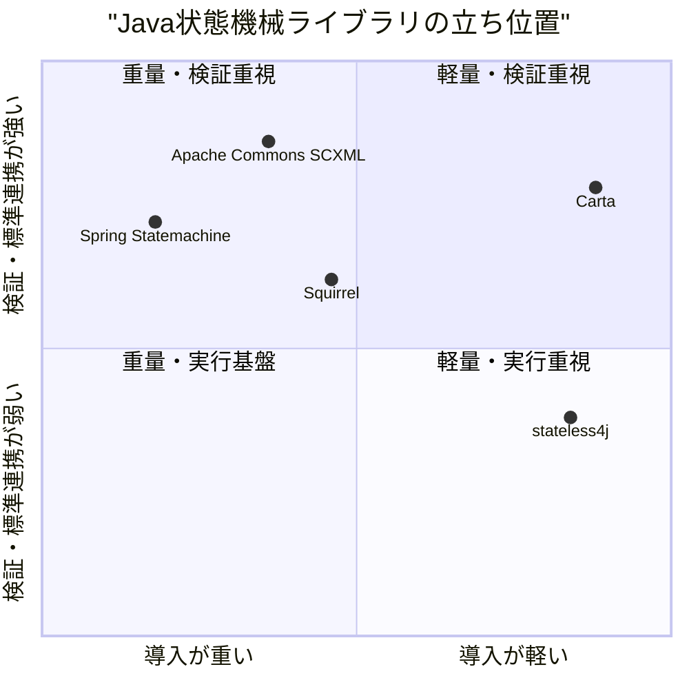
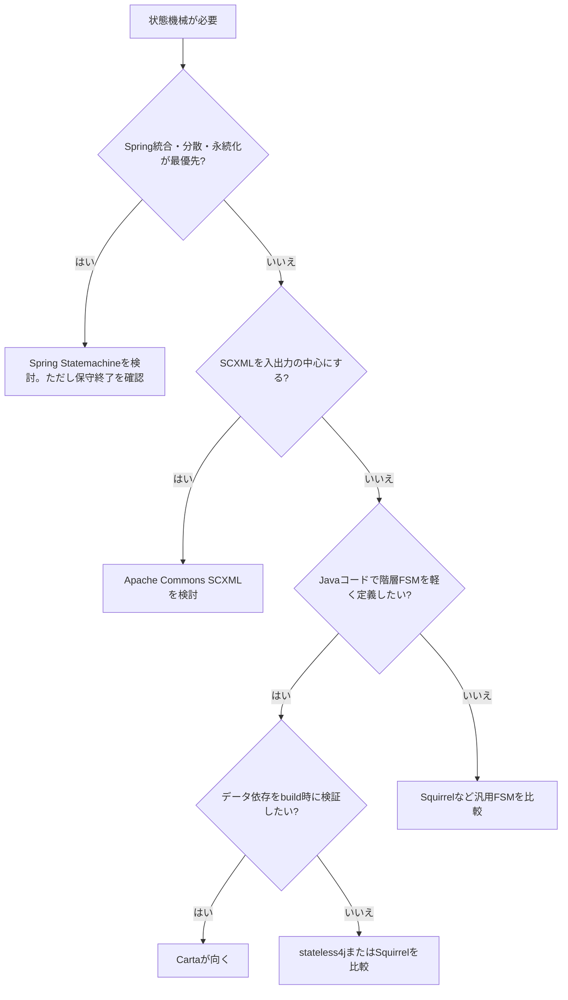

# 0. 要約

Cartaは、階層Statechartの表現力と、型付きデータフローのビルド時検証を組み合わせる小型Javaライブラリとして、既製品と正面衝突しない位置にいる。
最大の弱点は、まだ公開配布・外部利用の実績と、永続化・並行領域・標準形式連携の厚みが確認できないこと。
次の一手は、機能追加より先にMaven Central配布、最小README、検証結果を再現できるCIを整え、「軽量で検証できる」差を採用可能な形にすること。

# 1. このrepoは何か

Cartaは、Java 21で使う階層状態機械ライブラリである。`StateMachine.Builder`で状態・初期子状態・終端状態・イベント遷移を定義し、`CartaEngine`がイベント送信、entry/exit action、親状態へのイベントbubblingを実行する。加えて、`auto`、`external`、`branch`遷移と、`StateProcessor` / `TransitionGuard` の `requires()`・`produces()` を使い、`build()`時に遷移端点、複合状態の初期子、終端状態、auto/branchの循環、branch先、データフロー連鎖を検証する。`toMermaid()` と `toDataFlowMermaid()` も提供する。

提供価値は、業務フローを状態遷移として読める形にし、実行前に「必要な型が上流で生成されない」定義ミスを落とすことにある。利用者は、Springを必須にしたくないJavaアプリの開発者、特に注文・承認・ライフサイクルのような長いフローを扱う開発者を想定する。価値の単位はCarta単体の実行エンジンであり、LLMや別サービスとの組み合わせを前提にしない。

調査時点の客観指標は、main code 1,536 LOC、test code 965 LOC、JUnitの `@Test` 60件、`mvn test` 成功、生成jar 40,703 bytes、実行時依存0、テスト依存はJUnit Jupiter 5.10.2、Maven座標は `org.unlaxer:carta:1.0.0`、ライセンスはMITである。GitHub公開URLはREADMEの定義にあるが、Maven Centralへの公開は確認できない。

# 1.5. 調査の型

`library` と判定した。利用者はプログラマで、比較対象のコードと公開APIを読むべきカテゴリである。したがって、機能の数だけでなく、入力モデル（イベントかデータか）、階層・entry/exit、検証のタイミング、依存の重さ、テストと配布のしやすさを主軸にした。

# 2. 比較対象と選定理由

| 製品 | 何ができるか | 採用状況（2026-07-31参照） | ライセンス | うちとの決定的な違い | なぜ比較対象に選んだか |
|---|---|---|---|---|---|
| Squirrel | Javaの型付き・拡張可能なFSM。階層、fluent/annotation定義、entry/exit、条件、SCXML出力を持つ | ★2.3k。README掲載の最新リリースは0.3.10、最新snapshotは0.3.11-SNAPSHOT。最終コミット日: 取得できず | Apache-2.0 | 汎用FSMの拡張性・enterprise向け機能が厚い。Cartaの型付きデータフロー検証は別軸 | Javaで階層・型安全・アクションを比較できる最も直接的なOSS候補 |
| Spring Statemachine | Spring向けの階層FSM。guard/action、listener、永続化、Zookeeper、UML連携など | ★1.7k。2026-07-05にアーカイブ、READMEは「no longer maintained」。Mavenの最終系は4.0.0（2023-12-04掲載） | Apache-2.0 | 機能・統合は大きいがSpring依存と保守終了が採用リスク。Cartaは依存ゼロで単体利用 | Java業務アプリで最初に想起される重量級候補で、機能上限と保守リスクを測れる |
| stateless4j | JavaコードでFSMを定義。階層、entry/exit、guard、internal transition、parameterized trigger、introspection | ★933。Maven掲載の2.6.0を確認、リポジトリの最終コミット日: 取得できず | Apache-2.0 | 軽いイベントFSMだが `requires/produces` によるデータ依存検証はない | 小型・fluent APIの直接競合。Cartaが「軽い」だけでは差別化にならないことを確認するため |
| Apache Commons SCXML | SCXMLを読み込み実行するApacheのState Chart XML engine | ★67。README掲載の依存版は2.0-alpha-1、最終コミット日: 取得できず | Apache-2.0 | 標準形式・外部定義を重視し、XML engineとして使う。CartaはJava DSLとデータフロー契約を重視 | 階層Statechartの標準・相互運用側の代表として、Cartaの独自DSLの機会費用を測れる |

この地図は、機能の多さではSquirrel/Spring、導入の軽さではstateless4j、標準形式ではSCXMLが先行する乱立市場である。Spring Statemachineがアーカイブされたため、単純に「Spring互換」を狙うより、依存ゼロと実行前検証を明確な選択理由にする余地がある。star数は採用の代理指標にすぎず、特にSpringの数字は保守継続を意味しない。

# 3. ポジショニング

軸は、公開されている依存・統合・検証・SCXML機能からの定性的整理であり、数値ベンチマークではない。したがって、この図はstar数から位置を推定したものではなく、選択軸を可視化する補助図として読む。

# 4. 機能比較

| 機能 | 重み | Carta | Squirrel | Spring Statemachine | stateless4j | Apache Commons SCXML |
|---|---|---|---|---|---|---|
| Javaコードから定義 | ◎必須 | ○ | ○ | ○ | ○ | △ XML中心 |
| 階層状態・親へのイベント伝播 | ◎必須 | ○ | ○ | ○ | ○ | ○ |
| entry/exit action | ◎必須 | ○ | ○ | ○ | ○ | ○ |
| guard / 条件遷移 | ◎必須 | ○ | ○ | ○ | ○ | ○ |
| auto / branchによるデータ駆動フロー | ◎必須 | ○ | △ 条件・拡張で実現 | △ action/guard中心 | × | △ SCXMLのイベント・条件で構成 |
| `requires/produces` の型付き契約 | ◎必須 | ○ | × | × | × | × |
| build時の不正定義検証 | ◎必須 | ○ | △ 実行/生成時の検証 | △ 実行基盤の設定検証 | △ 設定APIの実行時検証 | △ XML解釈時 |
| auto/branch循環のDAG検証 | ○効く | ○ | × | × | × | × |
| Mermaid出力 | ○効く | ○ | ×（SCXML出力は○） | △ UML/Papyrus連携 | × | ×（SCXML入力が主） |
| 永続化・分散実行 | △あれば | △ `FlowStore`拡張点のみ | △ 拡張点 | ○ | × | × |
| 並行領域・orthogonal regions | △あれば | × | △ | ○ | × | △ |
| 外部標準形式（SCXML） | △あれば | × | ○ 出力 | △ UML連携 | × | ○ |
| 実行時依存の少なさ | ◎必須 | ○ 0 | △ | × Spring群 | ○ 小型 | △ Commons依存 |

Cartaの痛い×は、並行領域と標準形式連携である。ただし、現段階の採用理由はそこではなく、型付きデータフロー契約とauto-chainの組み合わせにある。逆に階層・guard・entry/exit・図示は各候補にもあり、そこだけを宣伝しても差別化にならない。永続化は`FlowStore`という拡張点があるが、JDBC/Redis実装が同梱されていないため○とは数えなかった。

# 4.5. コード・実装の比較

| 観点 | Carta | Squirrel | Spring Statemachine | stateless4j | Apache Commons SCXML | 出典 |
|---|---:|---:|---:|---:|---:|---|
| main LOC | 1,536 | 未集計 | 未集計 | 未集計 | 未集計 | 各リポジトリのソースを確認。Cartaは`find ... | wc -l` |
| 公開宣言行（public行の機械集計） | 127 | 未集計 | 未集計 | 未集計 | 未集計 | Cartaの`src/main/java`集計。外部はAPI表面の定義が異なるため未集計 |
| ランタイム依存 | 0 | 不明 | Spring依存 | 不明 | Commons依存 | 各README/pom。未確認値は不明 |
| テスト | 60 `@Test`、`mvn test`成功 | READMEにテスト案内あり、件数未集計 | Gradle build/test案内あり、件数未集計 | 件数未集計 | Maven/JUnit案内あり、件数未集計 | 各README、Cartaは実行結果 |
| 配布物 | `carta-1.0.0.jar` 40,703 bytes | Maven Central 0.3.10 | Maven系、4.0.0掲載 | Maven 2.6.0掲載 | Maven 2.0-alpha-1掲載 | 各README/Maven情報、Cartaは`mvn package` |
| 定義モデル | Java DSL、String状態、Event、型付きContext | generic state/event/context、fluent/annotation | Spring設定・builder | generic State/Trigger | SCXML/XML | 各プロジェクトREADMEとCarta実装 |

比較対象のコードは公開リポジトリのREADME、ソースツリー、代表的な実行クラス/APIまで確認したが、外部リポジトリをこの作業ツリーへcloneして同一条件でビルドするネットワーク経路は利用できなかった。そのため、外部のLOC・テスト件数・jarサイズは未集計とした。ここを埋めていないので、Carta自身の実測には高い確度を置けるが、横並びの実装重量比較は限定的である。

Cartaの実装方針は、定義をimmutableにし、`StateMachine`生成時に複数の検証をまとめて行い、実行側を小さく保つことにある。一方、Spring/Squirrelは統合・拡張点の多さを前提にしている。これは優劣というより、Cartaが「部品を増やす前に契約を強くする」設計を選んでいる差である。

# 5.5. 調査者の見立て

本当の勝負所は、階層状態そのものではなく、「状態遷移」と「データの受け渡し」を同じ定義から検証できることだと読める。階層、guard、entry/exitは既存候補にもあるが、`requires/produces`、dead data、DAG検証まで一つの小型APIに置く点は比較表で効いている。

数字に出ていない懸念は、まだ外部利用・リリース運用・互換性ポリシーが見えないことだ。特に`FlowStore`の説明は将来の拡張を示すが、実装はin-memoryのみで、採用者は自分で永続化を作る必要がある。

私なら、当面はSquirrelやSpringの機能競争をせず、「依存ゼロで、壊れたデータフローをbuild時に止めるJava 21ライブラリ」として配布と再現性を固める。Maven Central、CI、失敗例中心のドキュメントが先である。

この見立てが外れるとしたら、利用者がデータフロー検証を実際には必要とせず、単にSCXML互換またはSpring統合を求める場合だ。また、Squirrelが同等の検証機能を追加した場合、Cartaの最大の差は「小ささ」だけになり、現状のニッチ優位は崩れる。

# 6. 提案（優先順）

| 順 | 提案 | 分類 | 根拠 | 最小の一手 | 効きそうな指標 |
|---:|---|---|---|---|---|
| 1 | Maven Central配布とJava 21のCIを整える | 伸ばす | 4.5でランタイム依存0・40,703 bytesだが、公開配布を確認できない | `maven-publish`相当の公開手順、署名、Linux/WindowsのテストをCI化 | Maven Central導入数、CI成功率、初回導入時間 |
| 2 | `requires/produces`検証を主役にした失敗例・APIリファレンスを追加する | 伸ばす | ◎必須かつ既存候補との差別化。READMEの概念説明だけでは採用理由になりにくい | 未生成型、分岐漏れ、dead data、cycleの4例を独立サンプル化 | 失敗例からのissue削減、Hello World行数、API参照の網羅率 |
| 3 | `FlowStore`のSPI仕様と、まず1つの永続化アダプタを提供する | 埋める | 長期フローを掲げる一方、現状はin-memory実装のみ | シリアライズ境界・復元互換性を定義し、JDBCまたはJSONファイルの最小実装を別artifact化 | 復元テスト、利用可能なstore数、状態復元の成功率 |
| 4 | SCXML import/export、または少なくとも状態名・イベント名の型付きモデル化を検討する | 埋める | Apache Commons SCXMLが標準形式で強い。現状はMermaid出力のみ | まずSCXMLの対応範囲を決めた設計メモと変換不能要素の一覧を作る | 変換できるモデル割合、外部ツールからの移行時間 |
| 5 | Spring Statemachine互換の大規模統合・分散実行を当面やらない | やらない | Springは機能が厚く、同じ土俵では依存・保守・実装量で不利。Cartaの軽さを薄める | 非対応方針をREADMEに明記し、必要ならadapterを別repoに切り出す | 本体依存数、jarサイズ、コアAPIの破壊的変更数 |

「並行領域を追加する」は有力な将来課題だが、今すぐ最優先にはしない。Squirrel/Springとの差を広げる前に、現在のデータフロー検証が本当に安全性を上げることを実例と配布経路で証明する方が投資効率が高い（推測）。

# 7. 選択の分岐

# 8. 出典

| URL | 参照日 | 何の根拠に使ったか |
|---|---|---|
| https://github.com/opaopa6969/carta | 2026-07-31 | README記載の目的・API・比較、公開URL。実装指標は作業ツリーのREADME、Javaソース、pom.xml、テストを読んで確認 |
| https://github.com/hekailiang/squirrel | 2026-07-31 | 階層・型付きFSM、fluent/annotation、entry/exit、条件、Maven版0.3.10、★2.3k、Apache-2.0。公開ソースツリーと代表APIも確認 |
| https://github.com/spring-attic/spring-statemachine | 2026-07-31 | 機能一覧、Spring統合、Apache-2.0、★1.7k、2026-07-05アーカイブ、保守終了README |
| https://github.com/stateless4j/stateless4j | 2026-07-31 | generic State/Trigger、階層、entry/exit、guard、internal transition、★933、Apache-2.0、Maven 2.6.0。`StateMachine.java`の公開実装を確認 |
| https://github.com/apache/commons-scxml | 2026-07-31 | SCXML engine、Apache-2.0、★67、Maven掲載の2.0-alpha-1、公開ソースツリー |
| https://mvnrepository.com/artifact/org.springframework.statemachine/spring-statemachine | 2026-07-31 | Spring Statemachine 4.0.0の掲載日（2023-12-04）とMaven配布情報 |
| https://mvnrepository.com/artifact/com.github.oxo42/stateless4j | 2026-07-31 | stateless4jのMaven配布情報と過去版の日付 |
