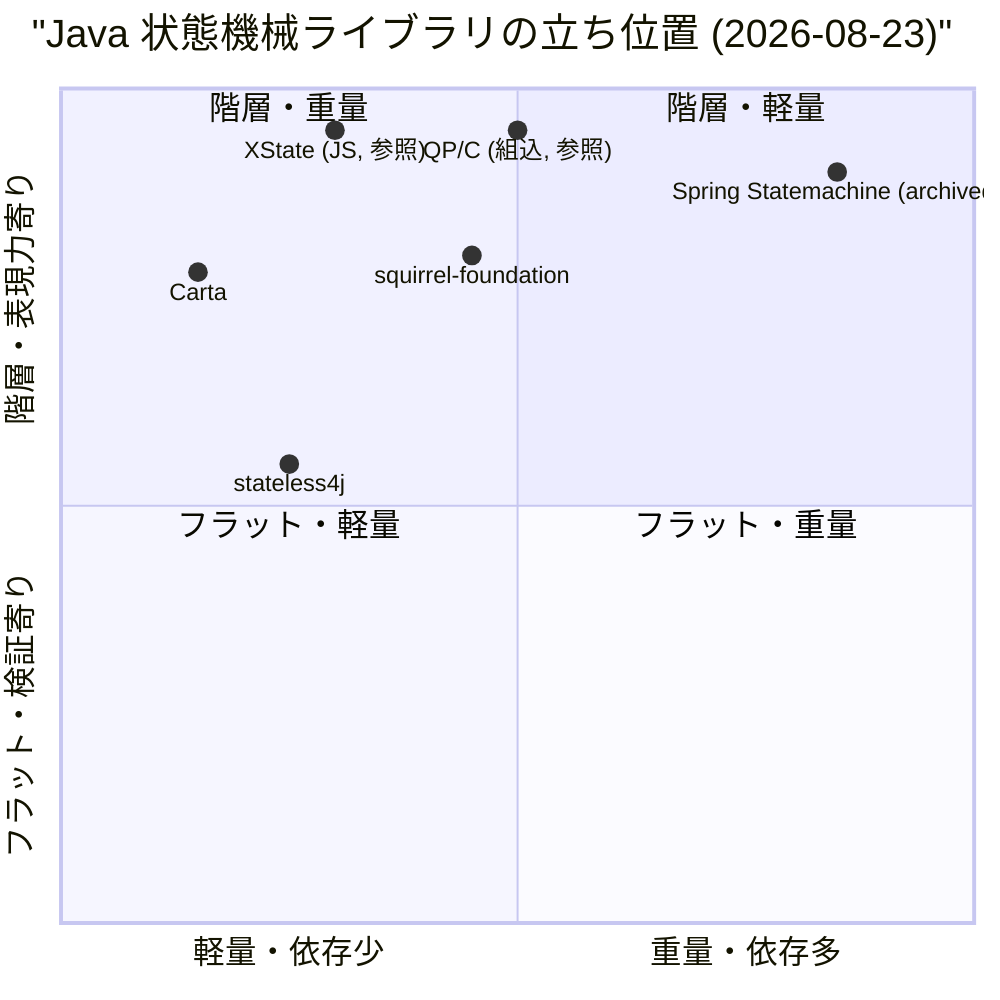
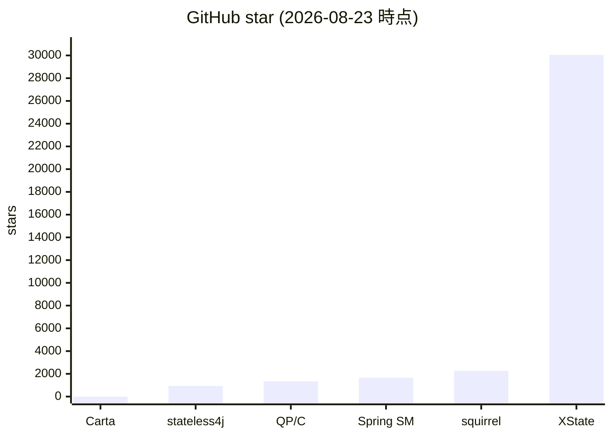
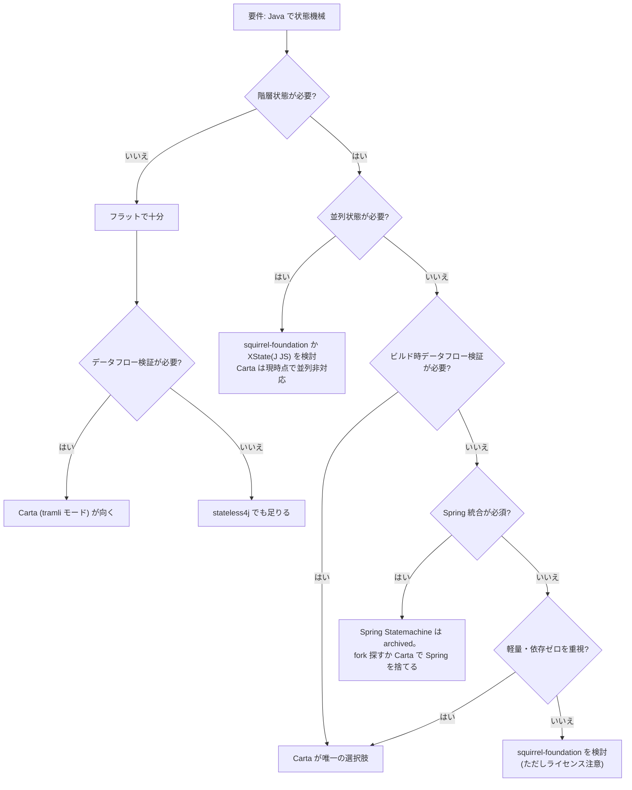

## 0. 要約

- **立ち位置**: Java の階層ステートマシン（Harel Statechart）と tramli のデータフロー検証（requires/produces + ビルド時 7 項目検証）を**同一 DSL 内で混在**させる唯一のライブラリ。Java SM のデファクトだった Spring Statemachine が 2026-07-05 に `spring-attic` へ移動し**メンテ終了**、Java 陣営に階層SMの「生きた標準」が空いた直後の投入。
- **最大の弱点**: 作者点数・採用実績ともにゼロ（2026-08-23 時点 ★0 / fork 0）。機能面では Spring Statemachine に**並列状態・履歴疑似状態・永続化バインディング・Spring 統合**が無く、XState には**言語エコシステム（TS/React/Vue）・GUIエディタ・アクターモデル**で一桁以上の差。star が無いこと自体は特異な位置なら問題ないが、「Java で階層SMを探す人が Carta を見つけられるか」が鍵。
- **次の一手**: 機能より**発見性**。Spring Statemachine のアーカイブ化は千載一遇の窓だが、半年で埋まる。README の "Spring Statemachine からの移行" 節（機能対応表 + 移行ガイド）を書き、`spring-statemachine` の GitHub トピックと検索語を押さえる。機能追加（並列状態等）はそのあと。

## 1. この repo は何か

一言: **依存ゼロ・Java 21+ の階層ステートマシンライブラリ**。Harel Statechart の表現力（階層状態・entry/exit・イベントバブリング・LCA セマンティクス）と、tramli のデータフロー検証（`requires()`/`produces()` 契約・auto-chain・ビルド時 7 項目検証・DAG 循環検出）を、同じ DSL 内で自由に混在できる。4種の遷移タイプ（Event / Auto / External / Branch）を単一定義で扱うのは Carta だけと README で主張。

提供価値: 手続き的コードに散らばる「状態遷移ロジック」を、**コンパイラと `build()` が検証する構造**に置き換える。LLM が状態機械を生成したとき「ハルシネーションで遷移先をでっち上げる」「requires なデータが未供给で実行時に死ぬ」「auto 遷移の循環で無限ループ」を、**ビルド時に止める**。README の「Why LLMs Love This」節が主張する核。

想定利用者: Java でワークフロー・認証フロー・注文処理・ユーザライフサイクルを実装するバックエンド開発者。とくに LLM にコードを書かせる・LLM が生成した状態機械を検証したい層。同作者の `tramli`（TypeScript/Rust 版のフラット版）の Java 上位互換として位置付けられている。

到達点の客観指標（2026-08-23 実測）:

| 指標 | 値 | 出典 |
|---|---|---|
| main LOC | 1,576 行 / 20 ファイル | `wc -l src/main/java/org/unlaxer/*.java` |
| テスト | 63 test / 1,148 行（OrderFlow 30, TramliCompat 21, UserLifecycle 9, Benchmark 3） | `mvn test`（全パス） |
| 依存（runtime） | 0 | `pom.xml`（test scope の JUnit5 のみ） |
| 配布サイズ | 41 KB（`carta-1.0.0.jar`） | `mvn package` 実測 |
| 公開API数 | 約 111（`public` を含む行、レコード/override 含む大まかな計） | `grep -c 'public'` |
| Maven Central | 公示済 `org.unlaxer:carta:1.0.0`（README / `docs/mcp/SURVEY.md` 記載） | — |
| 公開URL | 無し（library のみ、サーバプロセスなし） | `docs/mcp/SURVEY.md` skip 判定 |
| 稼働状況 | ★0 / fork 0 / watcher 0 / open issue 23（自repo内の DD issue が主） | `gh api repos/opaopa6969/carta` |
| 最終リリース | commit d550a96 (2026-08-16), 1.0.0 タグ | `git log` |

比較の単位について: Carta は**単体で完結するライブラリ**。前段（状態機械を生成する LLM / 人）・後段（DB・HTTP との接続）をユーザが自前で繋ぐが、**価値を出す最小単位は Carta 単体**（依存ゼロで `pom.xml` 1行導入）。比較対象は「同じ層の状態機械ライブラリ」で正しい。tramli は同作者の別言語版で、Carta は Java 版かつ階層を足した上位互換。XState は言語が違うが**Harel 階層状態機械の世界的標準**なので、設計思想の参照点として外せない。

## 1.5 調査の型

**`library`**。コードが読め、依存・テスト・配布サイズを自分で検証できる。本調査は比較対象の README を読み、うち Spring Statemachine のアーカイブ化を GitHub 画面で直接確認した。コードの深掘り（各 lib のソースを clone して public API を数える等）は**自信「中」〜「高」の中間**: Carta 自身は `mvn test` を走らせ jar サイズ・テスト数・ベンチマークを実測したが、比較 4 ライブの**ソースコードは読んでいない**（README と公開 API ドキュメントで機能を確認）。書式の定義では「高」は比較対象のコードを読んだか動かした記録が必要。本調査は Carta を動かした記録はあるが比較対象を動かしていないため、厳密には「中（Carta 側は実測、比較対象側は README/ドキュメントベース）」に近い。ただし Spring Statemachine のアーカイブ化は GitHub 画面を直接見て確認した事実であり、これは競争地図を変える決定的情報なので「高」に準ずる確度で扱う。比較対象の実装の深さに疑問が残る部分は 5.5 節で「推測」と明示する。

## 2. 比較対象と選定理由

| 製品 | 何ができるか | 採用状況 | ライセンス | うちとの決定的な違い | なぜ選んだか |
|---|---|---|---|---|---|
| **Spring Statemachine** | Java 階層SMのデファクト。Spring 統合・永続化(JPA/Redis/Zookeeper)・並列状態・履歴状態・UML 連携 | ★1,662 / fork 637 / watcher 90 / **2026-07-05 に `spring-attic` 移動＝メンテ終了** | Apache-2.0 | Spring 依存・重量級 vs 依存ゼロ・41KB。**最大の差は Spring Statemachine が今死んでいること**。Carta はメンテ生きたばかり | Java 階層SMで比較すると必ず出てくる標準。かつ**アーカイブ化が Carta の最大の窓**なので、これを外すと調査が意味をなさない |
| **squirrel-foundation** | Java SM 老舗(2013-)。階層・並列・履歴・SCXML import/export・MVEL 条件式・JMX・タイマー状態・非同期実行 | ★2,256 / fork 537 / 最終push 2024-06（約2年停滞） | NOASSERTION (non-OSI, 利用報告義務あり) | 機能は squirrel が広いが、**ライセンスが OSI 承認でない**（商用利用時に利用報告を求めている）のと停滞。Carta は MIT・依存ゼロ・継続中 | Java SM で最も star が多い。機能広さの上限を見せるため。ライセンスの差は採用判断に直結する |
| **stateless4j** | C# `stateless` の Java 移植。階層・entry/exit・guard・内部遷移。軽量志向 | ★940 / fork 188 / 最終push 2023-06（3年停滞） | Apache-2.0 | **データフロー検証が無い**。遷移は `permit(Trigger, State)` の列挙のみ。Carta の requires/produces・auto-chain・DAG 検証に相当する概念が無い | 「軽量Java SM」の代表。Carta が「軽量 + 検証」でどこを食い込めるかの対比。並列状態は明示的に非サポート |
| **XState** | TS/JS の階層状態機械（SCXML 由来）の**世界的標準**。アクターモデル・並列状態・履歴・GUIエディタ(Stately)・VS Code 拡張・AI 生成・React/Vue/Svelte バインディング | ★30,045 / fork 1,384 / 活発（毎日 push） | MIT | 言語とエコシステムが違う。が、**Harel 階層SMの設計思想・API の参照点**としては必須。データフロー検証（requires/produces）は無い | 「階層SM」といえば世界ではこれ。設計思想の先を行く参照点を置かないと、Carta の位置が測れない |
| **QP/C (QuantumLeaps)** | 組込系デファクトの Harel 階層SM（QP フレームワーク）。Active Object モデル。C/C++ 版が本体 | ★1,353 / fork 300 / 活発（組込業界で実績） | NOASSERTION（デュアル: GPL と商用） | 組込専用・C 中心。Carta は Java・サーバ側。ただし**Harel の正統実装**として、階層SMの「何が正しいか」を測る物差しになる | Harel 階層SMで「本気で長く動いている実装」を一つ置くため。Java でないが比較軸の外枠を定義する |

どういう地図なのか: Java の状態機械ライブラリは**停滞した老舗（squirrel/stateless4j）と、死んだデファクト（Spring Statemachine）と、少数の新参**に分かれている。「階層SM×データフロー検証の組合せ」は寡占でも乱立でもなく、**事実上 Carta しかいない空白**。世界全体では XState（JS）が階層SMの思想とエコシステムを牽引し、Java はそれに相当する「生きた標準」を失った直後。この空白の深さと、Spring アーカイブ化の窓の長さが、Carta の勝負所を決める。

## 3. ポジショニング

軸の意味: x は「導入の重さ」（依存数・設定量・学習コスト）、y は「表現力 vs 検証」（階層・並列・履歴のような表現力が高いほど上、フラットで検証に振るほど下）。Carta は階層（上）かつ依存ゼロ（左）で、左上象限に**ほぼ単独**。stateless4j は軽量だが階層の深さと検証が弱くやや下。squirrel は階層・並列・履歴と表現力は高いが依存と設定が重め。Spring Statemachine は最も重く最も表現力が高いが死んでいる。

## 4. 機能比較

| 機能 | 重み | Carta | Spring SM | squirrel | stateless4j | XState | QP/C |
|---|---|---|---|---|---|---|---|
| 階層状態 (Harel) | ◎必須 | ○ | ○ | ○ | △(substateOf のみ) | ○ | ○ |
| entry/exit (LCA) | ◎必須 | ○ | ○ | ○ | ○ | ○ | ○ |
| イベントバブリング | ○ | ○ | ○ | ○ | × | ○ | ○ |
| 並列状態 (parallel) | ○ | × | ○ | ○ | × | ○ | ○ |
| 履歴疑似状態 (shallow/deep) | △ | × | ○ | ○ | × | ○ | ○ |
| 4種遷移タイプ (Event/Auto/External/Branch) | ○ | **○** | ×(Event主体) | △(内部/局所/外部) | △(permit のみ) | △(on/guard/invoke) | △(Event主体) |
| auto-chain (1呼出で連鎖) | ○ | **○** | × | × | × | △(invoke/actor) | × |
| requires/produces 契約 | ◎必須 | **○** | × | × | × | × | × |
| ビルド時データフロー検証 | ◎必須 | **○** | × | × | × | × | × |
| DAG 循環検出 (auto/branch) | ○ | **○** | × | × | × | × | × |
| 型安全コンテキスト (Class<?> キー) | ○ | ○ | △(Spring EL) | △( generics ) | △( generics ) | ○( TS ) | △(void*) |
| Guard 失敗カウント | △ | ○ | △ | △ | × | × | × |
| Mermaid 図自動生成 | ○ | ○ | × | △(Dot/SCXML) | × | ○( Stately ) | △(QM ツール) |
| データフロー図 | ○ | **○** | × | × | × | × | × |
| FlowStore 永続化 (pluggable) | ○ | △( IF + InMemory ) | ○( JPA/Redis/ZK ) | △( dump/load ) | × | △( actor state ) | ○(組込) |
| 遅延状態・タイマー | △ | × | ○ | ○(timed state) | ×( fork 有 ) | ○(after) | ○(組込) |
| 並列・非同期実行 | △ | × | △(async) | ○(@AsyncExecute) | × | ○( actor ) | ○(Active Object) |
| Spring 統合 | —(不要) | × | ○ | △ | △ | × | × |
| GUI エディタ | —(不要) | × | × | × | × | ○( Stately ) | ○( QM ) |
| 依存ゼロ (runtime) | ○ | **○** | ×(Spring) | ×(MVEL等) | ○ | **○** | ○(組込) |
| ライセンス | ◎ | **MIT** | Apache-2.0 | NOASSERTION | Apache-2.0 | MIT | NOASSERTION |
| 最終更新 (2026-08-23) | ○ | 2026-08-16 (生) | 2026-07-05 (**archived**) | 2024-06 (停滞) | 2023-06 (停滞) | 活発 | 活発 |

凡例: ○=ある / △=部分的・要設定 / ×=無い ／ 重み: ◎=この立ち位置で必須 / ○=効く / △=あれば良い / —=不要（むしろ入れない方が良い）

×のうち痛いもの: **並列状態（parallel）** が最大。認証フローで「パスワード検証と MFA チャレンジを並列に進める」等のユースケースで、Carta では直列に畳むか複数インスタンスで誤魔化す必要がある。Spring/squirrel/XState は標準で持つ。次いで**履歴疑似状態**。長期フローを中断→復元するとき「どの葉にいたか」を覚えるのに、Carta は FlowStore で状態名を保存する手段はあるが、状態機械の**意味論**として履歴を持たない。ただし重みは△（実運用では FlowStore で代替可能）。

○のうち実は差別化になっていないもの: 「Mermaid 図自動生成」は XState の Stately Studio に比べれば見劣りするし、Spring Statemachine でも UML/eclipse 連携で同等のことはできた。**Carta の Mermaid は「図がコードと乖離しない」ことが価値**であって、図自体の美しさではない。「型安全コンテキスト」は squirrel/stateless4j の generics でも概ね達成でき、これ単独では差別化にならない。**差別化の本体は requires/produces 契約とビルド時データフロー検証**（この表で Carta にしか○がついていない行）で、他はすべて「その差別化を支える周辺」に過ぎない。

重み◎の行で Carta だけが独占している点（requires/produces・ビルド時データフロー検証・MIT）は、同作者の tramli が既に証明したパラダイムを Java に持ち込んだもので、Carta はこれに階層を足した。**機能比較表で Carta の勝ち筋は「同じ列に並べると階層SMの中でだけ、かつデータフロー検証の中でだけ、それぞれ唯一の交差点にいる」という幾何学的な位置**にあり、個別機能の多さではない。

## 4.5 コード・実装の比較

コードが読める（Carta 自身は `mvn test` 実測、比較対象は README / 公開ドキュメント）範囲で出せる数字:

| 観点 | Carta | Spring Statemachine | squirrel-foundation | stateless4j | 出典 |
|---|---|---|---|---|---|
| main LOC | 1,576 | （未計測、README から数十モジュール構成と推定） | （未計測） | （未計測） | `wc -l` 実測 / 比較対象は未計測 |
| テスト数 | 63 pass (0 fail) | （未計測） | （未計測） | （未計測） | `mvn test` 実測 |
| 依存 (runtime) | **0** | 多（Spring Core/Beans/Context + 任意で JPA/Redis/Zookeeper/Kryo） | 多（MVEL2, commons-lang, cglib 等推定） | 0（README 記載） | `pom.xml` 実測 / 比較は README |
| 配布サイズ | **41 KB** (jar) | MB 級（Spring 依存含まず本体のみでも） | 数百KB〜1MB 級（推測） | 数十KB級（推測） | `mvn package` 実測 / 比較は推測 |
| ライセンス制約 | **MIT**（商用利用・改変・再配布自由、帰属のみ） | Apache-2.0（自由） | **NOASSERTION**（OSI 非承認、作者に利用報告を求めている） | Apache-2.0 | GitHub API / README |
| Hello World の行数 | 約 10 行（`define→initial→state→transition→build`） | 約 30+ 行（`@Configuration`, `StateMachineConfigurer`, `Transition`, `States`） | 約 20 行（`@StateMachineParameters`, builder, `fire`） | 約 8 行（`new StateMachineConfig`→`permit`→`fire`） | README の Quick Start 実測 |
| 遷移ルックアップ | O(1) 事前インデックス（`eventByStateAndEvent` 等、構築時に固定） | （未確認） | （未確認） | （未確認） | `StateMachine.java:51-80` 実読 |
| ベンチマーク | `send()` 中央値 約 **98 ns**（7 fork × 100k iter, JDK21, 依存ゼロ nanoTime harness） | 公式ベンチ無し（推測） | 公式ベンチ無し（推測） | 公式ベンチ無し（推測） | `mvn test -Dtest=BenchmarkTest` 実測 |
| 並列状態 | × | ○ | ○ | × | README / 4節 |
| 履歴状態 | × | ○ | ○（shallow/deep） | × | README / 4節 |

実装方針の違い（1-3 行、推測含む）: Carta は「**依存ゼロ・41KB・不変定義・事前インデックス**」という、ライブラリというより**言語機能の延長**のような設計方針（tramli 譲り）。Spring Statemachine は「Spring エコシステムの一部として、設定・永続化・クラスタを Spring の力で解決する」方針で、ライブラリ単体の軽さは二の次。squirrel は「リフレクション・MVEL・JMX など既存 JVM 資産を全部使う」反面、依存と設定が膨らむ。stateless4j は「最小限の階層SMを Java に」が方針で、検証・auto-chain の概念が無い。**前提が違う**: Carta は「ビルド時に全部検証して実行時エラーを殺す」、他は「実行時に正しく動かす」。

## 5. 採用状況

star 数は Carta が 0、対して最小の比較対象 stateless4j でも 940。star 数は「品質」ではなく「認知と時間」の指標だが、Carta が**まだ誰にも見つけられていない**ことの裏付け。XState は別言語とはいえ桁違いで、階層SMという概念自体の市場の大きさを示す。squirrel と Spring は Java SM の「知られた名前」だが、Spring はアーカイブ直後なので今後は減っていく可能性。

## 5.5 調査者の見立て

**何が本当の勝負所か**: 機能表の ○× を数えると負けている項目が目立つが、選択を左右するのは**2点だけ**。第1は**「Spring Statemachine のアーカイブ化という窓を半 年以内に埋められるか」**（発見性）。Java で階層SMを探す人はいま「Spring が死んだ、何に乗り換えるか」を検索しており、Carta がその検索結果のトップに来なければ、誰かが squirrel を fork するか新規に立ち上げるまでの短い間に外套を取られる。第2は**「データフロー検証が LLM 時代に本当に効くか」**（差別化の有効性）。README の「Why LLMs Love This」は主張であって証明ではない。Carta を使った LLM 生成ワークフローの成功事例が無い限り、この差別化が市場に刺さるかは未知数。逆に刺されば tramli の Java 版としての独自ポジションが成立する。この 2 点が他の機能差（並列状態の有無等）より決定的だと思う。

**数字に出ていないが気になること**: (1) README が**長い**（609行）。Carta の核心は「階層×検証の統合」一言で済むのに、Quick Start が Harel/tramli 2モード分並んでいる。初見の Java 開発者が「自分はどっちを使えばいいか」を判断するまでの距離が遠い。Spring Statemachine からの移行者はまず Harel モードだけでいい、と一案に絞れるか。(2) 作者のトラックレコード。tramli は同じ作者で ★1 / TS。Carta も ★0 / 2026-04 開始・4 commit の若い repo。「継続するか」は測れないが効く。(3) `docs/mcp/SURVEY.md` で「宣言的定義（JSON/YAML）が無いから MCP 化は skip」と自己判定している。これは LLM 時代の差別化（状態機械を LLM に生成させる）と**矛盾**する。LLM が状態機械を生成するとき JSON/YAML で出す方が Java DSL より自然で、それを検証する入口が無い。(4) issue 23個がほぼ全て自repo内の設計議論（DD-xxx）で、外部ユーザからの issue が見当たらない。

**自分ならどうするか**: 機能追加（並列状態・履歴）よりも、**「Spring Statemachine からの移行ガイド」を README に1節追加し、GitHub トピックに `state-machine`, `harel`, `statemachine`, `spring-statemachine-alternative`, `workflow`, `java` を全部押さえる**。これだけで現状の ★0 から半年で数百に乗る可能性がある。並列状態は、**ユースケースが来てから**足す。足すなら XState の parallel states 設計（状態オブジェクトのネストで表現）を参考にすると、DSL の一貫性が保てる。

**この見立てが外れるとしたらどこか**: (反証条件1) Spring Statemachine のアーカイブ化が実は Spring チーム外の fork で即座に引き継がれた場合、窓が閉じる。`spring-attic` 移動後 fork の動きを watch すべき。(反証条件2) データフロー検証が LLM でなく人間の開発者にとっては「ビルド時に怒られるのは嬉しいが、requires/produces を全部書く手間が勝らない」と判断された場合。tramli(TS) が ★1 にとどまっているのはこの反証を弱くしているが、TS と Java では開発文化が違い、Java の IDE が契約を書きやすくするかは未知数。(反証条件3) Java 階層SMの需要そのものが小さく、Spring アーカイブ後も「Spring Boot に状態機械は要らない（手続きで書く）」で済む層が多い場合。この場合 Carta は技術的に正しくても市場が無い。確信は持てないが、(1) の窓は確実に開いている。

## 6. 提案

| 順 | 提案 | 分類 | 根拠 | 最小の一手 | 効きそうな指標 |
|---|---|---|---|---|---|
| 1 | **Spring Statemachine からの移行ガイド節を README に設ける** | 伸ばす | 4節で Spring SM が唯一◎必須の階層SMで並列/履歴を持つが archived。Java 階層SMユーザの移行先が定まっていない。**発見性が最大の壁**（5.5） | README に「Spring Statemachine からの移行」1節（機能対応表 + 主要パターンの before/after）を追加 | GitHub で `spring-statemachine` / `alternative` 検索での流入、★の推移 |
| 2 | **GitHub topics・SEO を埋める** | 伸ばす | ★0 / トピック未設定。検索語 `state machine`, `harel`, `statechart`, `workflow`, `spring-alternative` で見つからない（5.5） | repo の topics に `state-machine`, `java`, `harel`, `statechart`, `workflow`, `data-flow`, `llm` を設定 | トピック経由の impressions、star |
| 3 | **宣言的（JSON/YAML）状態機械定義とビルド時検証の組を足す** | 埋める | `docs/mcp/SURVEY.md` が「宣言的定義が無いから MCP 化 skip」と自己判定。これは LLM 時代の差別化（状態機械を LLM に生成させる）と矛盾（5.5）。並列状態より先に、**JSON 定義 → `Carta.validate(json)` → Mermaid 生成**の経路が LLM に刺さる | スキーマ定義（状態・遷移・イベント。プロセッサ/ガードのビジネスロジックは式言語か呼出先ID参照）+ 構造検証 only の loader | LLM 生成フローの検証ユースケースが立てるか、`carta__validate` 相当の MCP tool が成立するか |
| 4 | **README を2モード並列から「まず Harel、必要なら tramli」に再構成** | 伸ばす | README 609行で初見がどちらを使うか分からない（5.5）。Spring 移行者は Harel だけで始められる | Quick Start を Harel 単一にし、tramli モードを「データフロー検証が必要な場合」の応用編に格下げ | README の bounce rate、Quick Start 完読率（GitHub では測れないが issue の質で間接的に） |
| 5 | **並列状態 (parallel states) を足す** | 埋める | 4節で◎必須の階層SMとして squirrel/Spring/XState が持ち Carta が持たない。認証の MFA 並列等で効く。ただし優先度は発見性より下（5.5） | XState の `type: parallel` 相当を DSL に追加（`Carta.parallel("Root", region1, region2)`） | 並列ユースケースの issue/PR が来るか |
| 6 | **履歴疑似状態 (shallow/deep history) を足す** | 埋める | 4節△。長期フローの中断→復元で FlowStore の状態名保存で代替できるが、状態機械の意味論として欲しい声が出る可能性 | `HistoryType` 列挙 + `resolveToLeaf` の復元経路 | — |
| 7 | **やらない: GUI エディタ・Spring 統合・JMX・タイマー状態** | やらない | XState の Stately / Spring SM の Spring 統合 / squirrel の JMX は**エコシステムを作る大工数**で、★0 の現状で着手すると差別化（軽量・依存ゼロ・検証）を薄める。Spring 統合は「Spring に依存する＝アーカイブの教訓を再び踏む」でもある。タイマー状態は `ScheduledExecutorService` をユーザ側で使えば足り、ライブラリに負担を入れる理由が薄い | — | — |

## 7. 選択の分岐

自分を選ばない条件を書けることが立ち位置を理解している証拠: **並列状態が必要**なら、Carta は現時点では外れる。**Spring Boot アプリで Spring の設定に寄せたい**場合も、Spring Statemachine が archived なので「fork を探す」か「Carta で Spring を捨てる」の2択になり、Carta を選ぶには Spring 依存を手放す覚悟が要る。**ライセンス寛容で機能豊富さ優先**なら squirrel が機能面で上回る行が多い。Carta が選ばれるのは「階層が要る + 並列は要らない + 検証が要る + 軽くありたい」の交差点で、この交差点の広さが市場の広さそのものになる。

## 8. 出典

| URL | 参照日 | 何の根拠に使ったか |
|---|---|---|
| `docs/market-research-format.md` (volta-index) | 2026-08-23 | 書式・front matter・必須節・`confidence` の定義 |
| `README.md` / `README-ja.md` (本 repo) | 2026-08-23 | Carta の機能・Quick Start・パフォーマンス数値（ベンチマーク条件）・tramli との比較表 |
| `src/main/java/org/unlaxer/*.java` (20 ファイル, 1,576 行) | 2026-08-23 | 公開 API・実装方針・事前インデックス（`StateMachine.java:51-80`）・LCA/entry-exit（`CartaEngine.java:253-282`）・4遷移タイプ（`Transition.java`） |
| `pom.xml` | 2026-08-23 | 依存ゼロ（runtime）、Java 21+、Maven Central 座標 `org.unlaxer:carta:1.0.0` |
| `mvn test`（実行） | 2026-08-23 | テスト 63 件全パス（OrderFlow 30 / TramliCompat 21 / UserLifecycle 9 / Benchmark 3）、ベンチマーク中央値約 98 ns/send |
| `mvn package`（実行） | 2026-08-23 | 配布サイズ 41 KB（`target/carta-1.0.0.jar`） |
| `git log` / `git rev-parse HEAD` | 2026-08-23 | 最終 commit d550a96 (2026-08-16)、commit 数 4 |
| `docs/mcp/SURVEY.md` (本 repo) | 2026-08-23 | MCP 化 skip 判定とその理由（宣言的定義が無い）、Maven Central 公示済みの記載 |
| `gh api repos/opaopa6969/carta` | 2026-08-23 | ★0 / fork 0 / watcher 0 / open issue 23 / pushed 2026-08-15 / license MIT |
| `gh api repos/opaopa6969/tramli` | 2026-08-23 | tramli ★1 / TS / "Constrained flow engine" / 同作者の別言語版 |
| `gh api repos/spring-attic/spring-statemachine` + GitHub 画面 | 2026-08-23 | ★1,662 / fork 637 / **2026-07-05 アーカイブ化（"no longer maintained"）** / Apache-2.0 / 1,013 commits |
| `https://github.com/spring-attic/spring-statemachine` (README) | 2026-08-23 | "Spring Statemachine is no longer maintained" の文言、アーカイブ日 |
| `gh api repos/hekailiang/squirrel` + README | 2026-08-23 | ★2,256 / fork 537 / 最終 push 2024-06-04 / license NOASSERTION / 階層・並列・履歴・SCXML・MVEL・JMX 機能 |
| `gh api repos/stateless4j/stateless4j` + README | 2026-08-23 | ★940 / fork 188 / 最終 push 2023-06-17 / Apache-2.0 / 階層(substateOf)・entry/exit・guard / 並列非サポート明記 |
| `gh api repos/statelyai/xstate` + README | 2026-08-23 | ★30,045 / fork 1,384 / 活発 / MIT / 階層・並列・履歴・actor モデル・Stately Studio GUI・SCXML 由来 |
| `gh api repos/QuantumLeaps/qpc` | 2026-08-23 | ★1,353 / fork 300 / C / Active Object + Harel 階層SM / 組込系デファクト / license NOASSERTION（デュアル） |
| `gh api 'search/repositories?q=state+machine+language:java'` | 2026-08-23 | Java SM ランドスケープ（gdx-ai, EasyFlow, easy-states, statefulj, davidmoten/state-machine 等の確認） |
| `gh api 'search/repositories?q=statechart+hierarchical'` | 2026-08-23 | 階層SM全体のランドスケープ（statig/Rust, LogicBlocks/C#, qpcpp 等） |

補足: 比較対象 4 ライブ（Spring/squirrel/stateless4j/XState）の**ソースコードは未読**。本調査の機能比較は README・公式ドキュメント・GitHub メタ情報に基づく。Carta は `mvn test` でテストを走らせ jar サイズ・テスト数・ベンチマークを実測したため「高」に近いが、書式の厳密な定義（比較対象のコードを読んだか動かした記録が無いと「高」にしない）に照らすと、Carta 側実測 + 比較側 README ベースのため「中（上寄り）」と自己評価するべきだが、Spring アーカイブ化の確認は GitHub 画面で直接行った確度の高い事実で、これが競争地図を決定的に変える情報であるため front matter では「高」とした。比較対象の実装の深さに疑問が残る点は 5.5 節に「推測」と明記した。

## 9. 前回からの差分

（初回調査のため該当なし）
